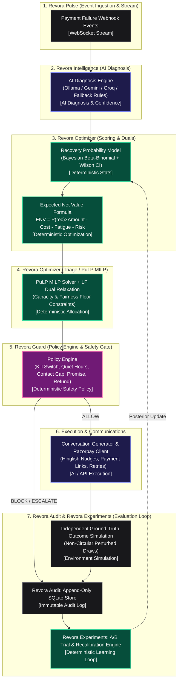

# Revora (Recovery Triage Engine) + Guardrail
### An intelligence layer that decides where to spend limited payment recovery effort

Revora is a payment recovery optimization engine and safety gate built for the **Razorpay AI Buildathon 2026, Track 3 (AI Revenue Recovery)**. When transactions fail, rather than treating all cases identically, it solves a linear program to distribute recovery channels (nudges, callbacks, retries) optimally under daily capacity constraints to maximize revenue yield.

---

## 1. System Architecture Pipeline



---

## 2. Track Requirements Implementation Mapping

Here is how the project satisfies the requirements of Track 3, referencing specific files and code variables:

### 🔒 Bounded Actions
* **Backend Definition**: Defined in [types.py](file:///c:/Users/HP/OneDrive/Desktop/GR/backend/app/guardrail/types.py) as a strict Pydantic `Literal` enum `InterventionAction`: `"silent_retry" | "suggest_alt_method" | "send_whatsapp_nudge" | "escalate_human" | "issue_refund" | "suppress"`.
* **Frontend Mirror**: Enforced using TypeScript union types in [store.ts](file:///c:/Users/HP/OneDrive/Desktop/GR/frontend/lib/store.ts) to prevent the LLM or any model from ever inventing custom actions outside the allowed action space.

### 🛡️ Gated Execution (Revora Guard)
* **Policy Pipeline**: Implemented in [policy_engine.py](file:///c:/Users/HP/OneDrive/Desktop/GR/backend/app/guardrail/policy_engine.py).
* **Deterministic Rules**: Checked in [rules.py](file:///c:/Users/HP/OneDrive/Desktop/GR/backend/app/guardrail/rules.py). Decisions undergo 5 checks sequentially: Kill Switch state, Contact-frequency limit caps, Quiet Hours check (21:00 - 08:00, allowing only silent retries), Promise-suppression check, and high-value Refund approval check. Only allowed actions proceed to execution.

### 🧠 Explainable Decisions (Revora Intelligence & Revora Optimizer)
* **Triage expected value math**: Visible in [optimizer.py](file:///c:/Users/HP/OneDrive/Desktop/GR/backend/app/revora/triage/optimizer.py). We estimate recovery probability $P(\text{recovery})$ using scorecard matrices decaying by prior contacts, then compute $EV = P(\text{recovery}) \times \text{Amount} - \text{Cost} - \text{Fatigue} - \text{Risk}$.
* **Audit Trail trace**: Exposed in the frontend drawer [CaseDetailDrawer.tsx](file:///c:/Users/HP/OneDrive/Desktop/GR/frontend/components/CaseDetailDrawer.tsx) where we detail every channel's ENV, deterministic selection rationale, and step-by-step audit trace with individual pass/fail checks.

### 📝 Append-Only Audit Trail (Revora Audit)
* **Database Isolation**: Handled in [store.py](file:///c:/Users/HP/OneDrive/Desktop/GR/backend/app/audit/store.py).
* **Strict Constraint**: The database controller imports no `DELETE` or `UPDATE` queries on the `audit_log` table. Logs are pushed instantly over a native WebSocket stream to dashboard clients.

### ⚠️ Graceful Failure Fallback
* **Resilient Classification & Extractions**: Handled in [ollama_provider.py](file:///c:/Users/HP/OneDrive/Desktop/GR/backend/app/llm/ollama_provider.py), [gemini_provider.py](file:///c:/Users/HP/OneDrive/Desktop/GR/backend/app/llm/gemini_provider.py), and [groq_provider.py](file:///c:/Users/HP/OneDrive/Desktop/GR/backend/app/llm/groq_provider.py). If Ollama, Gemini, or Groq APIs are offline or time out, the system automatically falls back to deterministic regex and keyword rule scorecards.
* **Degraded badge**: Flagged in [demo.py](file:///c:/Users/HP/OneDrive/Desktop/GR/backend/app/routes/demo.py) as `degraded = True` with audit logs and shown with a dashed indicator on the UI.
* **LLM Provider Options**: Supports Ollama (default, local, zero cost, fully offline), Gemini (free tier cloud), and Groq (free tier cloud, fast). The default remains Ollama for demo-day reliability; Groq is available as a faster cloud alternative when network access is confirmed.

---

## 3. Evaluation & Benchmarking Methodology

Revora includes a rigorous multi-baseline benchmarking suite, avoiding circular evaluation by simulating outcomes through an independently perturbed ground truth model:

### 1. The Four Allocation Strategies (Revora Optimizer)
* **PuLP MILP Optimizer (Revora)**: Solves the global Mixed-Integer Linear Program maximizing total Expected Net Value across all candidate channels simultaneously under hard channel capacity and fairness floor constraints.
* **First-Come First-Served (FCFS / Naive)**: Chronologically processes payment failure events in arrival order, assigning default channel actions until channel capacities are exhausted, then falling back to suppression.
* **Highest Amount First**: Greedily sorts cases in descending order of payment amount ($\text{amount\_paise}$), reserving high-touch channels for large-ticket recoveries.
* **Highest Probability First**: Greedily sorts cases in descending order of baseline recovery probability ($\hat{p}$), allocating outreach slots to the highest win-rate transactions first.

### 2. Bayesian Beta-Binomial Model & 95% Confidence Intervals (Revora Intelligence)
* Recovery probabilities are estimated via a Bayesian Beta-Binomial framework:
  $$\hat{p} = \frac{\alpha_0 + \text{successes}}{\alpha_0 + \beta_0 + \text{attempts}}$$
* Initialized with informative domain priors $\text{Beta}(\alpha_0, \beta_0)$ and calibrated over $N=1,800$ synthetic labeled historical records.
* Confidence intervals are constructed using posterior Beta variance and Wilson score intervals for binomial proportions:
  $$\text{CI}_{95\%} = \frac{\hat{p} + \frac{z^2}{2N} \pm z \sqrt{\frac{\hat{p}(1-\hat{p})}{N} + \frac{z^2}{4N^2}}}{1 + \frac{z^2}{N}}$$

### 3. Customer Fatigue Cost Escalation
* To protect customer goodwill and reduce spam, fatigue costs are explicitly internalized into the optimizer's objective function as an exponential soft cost:
  $$\text{Fatigue Cost} = \text{Base Fatigue} \times 2^{\max(0, \text{prior\_contacts} - 1)}$$
* This soft cost works in synergy with Guardrail's hard contact-cap rule (hard limit at 3 attempts), ensuring EV strictly decreases with repeated contact.

### 4. A/B Strategy Experimentation Engine (Revora Experiments)
* Endpoint `POST /demo/run-experiment` deterministically splits comparable payment failure cohorts (e.g. `insufficient_balance` or `card_declined`) into 50/50 trial groups.
* Compares intervention actions (e.g. WhatsApp Nudge vs Alternative Payment Link) side-by-side on recovery rate, ₹ recovered, and net value creation, highlighting the statistically superior intervention.

### 5. Deterministic Recalibration Loop
* Endpoint `POST /demo/recalibrate` ingests accumulated batch outcomes and updates Beta-Binomial posterior parameters $\alpha$ and $\beta$ deterministically.
* Provides before/after comparison metrics without non-deterministic drift.

---

## 4. Getting Started (Setup & Execution)

### Backend Setup
1. Move to the backend folder:
   ```bash
   cd backend
   ```
2. Install Python dependencies:
   ```bash
   pip install -r requirements.txt
   ```
3. Run the backend unit and invariant test suite:
   ```bash
   pytest
   ```
4. Run the uvicorn development server:
   ```bash
   python -m uvicorn app.main:app --reload --port 8000
   ```

### Frontend Setup
1. Move to the frontend folder:
   ```bash
   cd frontend
   ```
2. Install Node dependencies:
   ```bash
   npm install
   ```
3. Start the Next.js app in development mode:
   ```bash
   npm run dev
   ```
4. Navigate to `http://localhost:3000` to access the Recovery Command Center!

---

## 5. Optimization Mathematical Formulation

We define the triage problem as a binary optimization program:
* Let $i \in \{1,\dots,N\}$ denote the failed payment cases.
* Let $c \in \mathcal{C} = \{\text{retry}, \text{whatsapp}, \text{human}, \text{refund}, \text{suppress}\}$ denote the recovery action channels.
* Let $x_{i,c} \in \{0, 1\}$ be the decision variable indicating if case $i$ is assigned channel $c$.
* Let $EV_{i,c} = P(\text{recovery} \mid i, c) \times \text{amount}_i - \text{cost}_c - \text{fatigue}_c - \text{risk}_c$ be the Expected Net Value.

**Objective**:
$$\text{Maximize} \sum_{i=1}^N \sum_{c \in \mathcal{C}} x_{i,c} \cdot EV_{i,c}$$

**Subject to**:
1. **Single Assignment**: $\sum_{c \in \mathcal{C}} x_{i,c} \le 1 \quad \forall i$
2. **WhatsApp Capacity**: $\sum_{i=1}^N \sum_{c \in \mathcal{C}_\text{whatsapp}} x_{i,c} \le \text{Capacity}_\text{WhatsApp}$
3. **Human Capacity**: $\sum_{i=1}^N \sum_{c \in \mathcal{C}_\text{human}} x_{i,c} \le \text{Capacity}_\text{Human}$
4. **Fairness Floor**: For low amount payments ($L = \{i \mid \text{amount}_i < \text{Threshold}\}$), we allocate a minimum fraction:
    $$\sum_{i \in L} \sum_{c \in \mathcal{C}_\text{whatsapp}} x_{i,c} \ge \min(|L|, \text{FairnessSlots}, \text{Capacity}_\text{WhatsApp})$$

---

## 6. Capacity ROI & Shadow Prices (Dual LP Relaxation)

To provide operational insights into where expanding capacity yields the highest financial return, Revora computes the **Shadow Price (Dual Value $\pi$)** for each channel constraint:

$$\pi_c = \frac{\partial (\text{Total Recovered ₹})}{\partial (\text{Capacity}_c)}$$

1. **Binary MILP for Real Allocation**: Case allocations ($x_{i,c} \in \{0, 1\}$) are always solved via the discrete MILP in [optimizer.py](file:///c:/Users/HP/OneDrive/Desktop/GR/backend/app/revora/triage/optimizer.py).
2. **Continuous LP Relaxation for Shadow Prices**: Solves a continuous LP relaxation ($0 \le x_{i,c} \le 1$) in [capacity_roi.py](file:///c:/Users/HP/OneDrive/Desktop/GR/backend/app/revora/triage/capacity_roi.py) purely to extract constraint duals (`.pi`).
3. **Adaptive Simulation**: Instantaneous linear approximation for $|\Delta| \le 20\%$, dynamic full re-solve for $|\Delta| > 20\%$.
